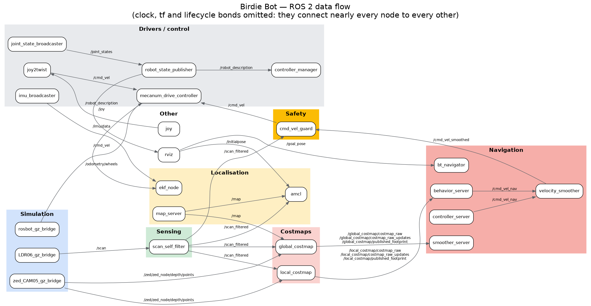

# Birdie Bot — design notes

A ROSbot XL with an OpenMANIPULATOR-X arm and an eye-in-hand depth camera,
driving a simulated badminton court, finding shuttlecocks, picking them up and
dropping them into an onboard hopper.

This document explains **why** the code is the way it is. The code itself says
what it does; comments in it say why a particular line is the way it is. This
document is the layer above that: what each component is for, which decisions
were forced by something real, and which numbers came from measurement rather
than taste.

Almost everything surprising here was found by running the thing and reading
what came back, not by reasoning about it beforehand. Where a design looks
over-complicated, there is usually a failure behind it, and the failure is
recorded alongside so nobody removes the fix and rediscovers it.

---

## 1. Vocabulary

Terms used throughout, in the sense this project uses them.

**ROS 2** — the middleware everything runs on. Programs are *nodes*; they
communicate by publishing and subscribing to named *topics*, by calling
*services* (request/response), and by *actions* (long-running requests with
feedback, like "navigate to this pose").

**Gazebo** — the physics simulator. It owns the ground truth: where the robot
and every object actually is. A *bridge* process copies messages between
Gazebo's own transport and ROS topics.

**Ground truth** — what is really true in the simulator, as opposed to what the
robot believes. Available to the test harness but not to the robot. Comparing
the two is how most bugs here were found.

**TF (transform tree)** — ROS's bookkeeping for "where is frame A relative to
frame B", continuously, with timestamps. Frames used here:

- `map` — the fixed world frame the map is drawn in.
- `odom` — a frame that drifts but is smooth; wheel odometry accumulates in it.
- `base_link` — the robot body. Everything on the robot is described relative
  to this, so "x 0.065" means 65 mm forward of the robot's centre.
- `rplidar_link`, `hopper_link`, `link5` — parts of the robot.

A *transform lookup* asks TF for the relationship between two frames. It can
fail: the transform may not exist yet, or the timestamp asked for may be
outside the buffered window.

**AMCL** (Adaptive Monte Carlo Localization) — the algorithm that works out
where the robot is on the map. It maintains a cloud of guesses ("particles"),
compares what the laser scanner sees against what the map says should be
visible from each guess, and concentrates the cloud where they agree. Output is
the `map -> odom` transform, which combined with odometry gives `map ->
base_link`: the robot's believed pose.

**Seed** (verb, "to seed AMCL") — to tell AMCL roughly where the robot is, so
its particle cloud starts in the right place instead of spread over the whole
map. Done by publishing to `/initialpose`. Without a seed AMCL publishes no
transform at all, and everything downstream that needs to know where the robot
is fails. This project seeds explicitly at every point the robot is teleported,
because a teleport moves the body without generating any odometry, so AMCL
never sees the jump and would otherwise keep believing the old position.

**Costmap** — a grid over the world marking where the robot may not go.
"Lethal" cells are obstacles; cells near them carry *inflation* cost so paths
prefer to keep clear. Two exist: a *global* one covering the whole map for
route planning, and a *local* rolling window around the robot for immediate
avoidance.

**nav2** — the ROS 2 navigation stack. Given a goal pose it plans a route
(planner), follows it (controller), and runs recovery behaviours when stuck.

**MPPI** (Model Predictive Path Integral) — the local controller used here. Each
cycle it samples many possible short-term trajectories, scores each with a set
of *critics* (how close to the path, how close to the goal, does it hit
anything), and blends the good ones into a velocity command. Being
sample-based, it can only choose among trajectories it can see the whole of —
which is why the local costmap's size turned out to cap the robot's speed.

**Lifecycle node** — a ROS 2 node with explicit states: unconfigured →
inactive → active. A *lifecycle manager* walks a group of them through those
transitions in order. nav2 uses this so the stack comes up in a defined
sequence.

**Bond** — a heartbeat between a lifecycle manager and each node it manages. If
a beat is missed for longer than `bond_timeout`, the manager declares the node
dead and tears the stack down. On a loaded machine a healthy node can miss a
beat simply because it did not get scheduled, which is why this project
disables the bond.

**Race (race condition)** — a bug where correctness depends on which of two
concurrent things finishes first, and neither is forced to be first. It is
nastier than an ordinary bug because it usually works. The seed-before-
navigation ordering in this project is a race that was "working" until it
wasn't.

**DDS** — the transport underneath ROS 2 topics. The default implementation
(FastDDS) uses shared memory segments in `/dev/shm`. Killed processes can leave
those behind, and enough debris eventually exhausts port allocation. Symptom:
topics apparently flowing while `ros2 node list` returns nothing.

**QoS (Quality of Service)** — per-topic delivery policy. `RELIABLE` retries
lost messages; `BEST_EFFORT` does not. A publisher must offer at least what a
subscriber requires, so a BEST_EFFORT publisher and a RELIABLE subscriber
silently never connect.

**URDF / xacro / SRDF** — the robot's description. URDF is XML listing *links*
(rigid bodies) and *joints* between them. xacro is a macro layer over it, so
the description can take arguments. SRDF is the companion file MoveIt uses,
listing joint groups, named poses, and — importantly here — which pairs of
links are allowed to touch.

**MoveIt** — the arm motion planning framework. Given a goal it plans a
collision-free joint trajectory. It checks collisions against the model it was
given, which is only as good as the description handed to it.

**IK (inverse kinematics)** — given a desired position for the hand, compute
the joint angles that put it there. *Forward* kinematics is the other
direction. This arm has 4 usable joints, so a full 6-DOF pose goal is
over-constrained and the code solves it analytically instead.

**Tool pitch** — the angle of the gripper's axis against the horizontal. π/2
points it straight down (for picking off the floor); 0 lays it flat. It matters
because the jaws hold the object *across* that axis, so pitch determines
whether the shuttlecock is held horizontal or upright.

**RTF (real-time factor)** — simulated seconds per wall-clock second. 1.0 is
real time. Below that, everything the robot does takes proportionally longer in
wall time, and timeouts written in wall time start to bite.

**Shuttlecock geometry** — a cork nose with a feather skirt. It is not
symmetric: the cork is dense and narrow, the skirt is light and wide. Which end
points where matters for both gripping and dropping.

---

## 2. Shape of the system



Generated from the running system by `scripts/dev/graph_dump.py`. `/clock`,
`/tf` and the lifecycle `/bond` topics are hidden, because they connect nearly
every node to every other and bury the structure: in the unfiltered graph
(`media/ros_graph_full.png`) **89% of the edges are `/parameter_events` and
`/rosout`**, which every ROS 2 node subscribes to automatically, and only 2.6%
is actual data flow.

Two nodes in that picture are this project's; eighteen are stock nav2 and the
rest are Gazebo bridges, ros2_control, MoveIt and rviz.

```
Gazebo  ──bridge──>  /scan ─> scan_self_filter ─> /scan_filtered ─┬─> AMCL ─> map->odom
                                                                  └─> costmaps
                     /zed/... (rgb + depth) ──────────────────────┬─> costmaps
                                                                  └─> grasp_ball, NavGrasp
nav2  ──>  /cmd_vel_smoothed  ─>  cmd_vel_guard  ─>  /cmd_vel  ─>  wheels
```

Three layers of control, deliberately separate because each fails differently:

1. **nav2** drives the robot across the court. It works in the `map` frame and
   trusts AMCL.
2. **`fine_approach`** closes the last stretch, still on AMCL, but with a simple
   turn-then-drive controller rather than a sampled optimiser.
3. **`visual_servo`** does the final correction from the camera alone. It trusts
   nothing in the map frame, which is what makes the whole thing robust to
   localisation error.

The pick itself (`grasp_ball.py`) is a separate process launched per attempt.
That is deliberate: MoveIt holds C++ state tied to the rclpy context, and
running it once per pick in a fresh process avoids a class of teardown
problems.

---

## 3. Bringup order

`launch/grasp_trial.launch.py`, and previously `scripts/ops/bringup.sh`.

```
gazebo -> scan filter + guard -> localization -> SEED AMCL -> navigation -> trials
```

**The seed must land before navigation starts.** nav2's global costmap refuses
to activate without a `map -> base_link` transform. That transform comes from
AMCL, and AMCL publishes nothing until seeded. If navigation launches first,
the costmap's activation times out, that failure fails `planner_server`, and
the lifecycle manager abandons the rest of the bringup. The result is a
half-active stack: `controller_server` up, everything else inactive. Every
mysterious half-active stack in this project traced back to this ordering.

The launch file chains navigation to the seed's **process exit**, not to a
timer. A timer version raced and lost — the seed needed a second attempt,
reported success *after* navigation had already started, and the ordering held
only by luck. A non-zero seed now aborts the launch rather than handing nav2
something it cannot activate.

**Both nav2 launches run with `autostart:=false`**, and `arm_lifecycle.py`
starts them afterwards. This is about the bond heartbeat. `bond_timeout` is
read when a bond is *created*, which happens at activation. With autostart the
managers bond immediately, before anything can change the parameter, and a
later `ros2 param set` is accepted, reports success, and does nothing. The
manager keeps the heartbeat it was born with and eventually declares a healthy
server dead under load:

```
CRITICAL FAILURE: SERVER map_server IS DOWN after not receiving a heartbeat
Deactivating amcl
```

which takes `map -> base_link` with it and fails everything downstream in ways
that look like localisation bugs. `arm_lifecycle.py` therefore *replaces* the
stock manager with one constructed with `bond_timeout:=0.0`, then sends
STARTUP. The `exit code -9` lines this produces in the log are expected.

---

## 4. `grab_sequence/grasp_ball.py` — the pick

One process, one pick. Sees the shuttlecock, works out where and how to grab
it, grabs it, carries it to the hopper, drops it in.

### Analytic IK instead of a MoveIt pose goal

`ik_planar` / `arm_joints_for` solve the arm in closed form rather than asking
MoveIt for a pose goal. With only 4 usable joints a 6-DOF pose goal is
over-constrained and OMPL's goal sampler simply fails with "Unable to sample
any valid states for goal tree". The analytic solution sidesteps that and is
also fast enough to probe in bulk, which is how most of the geometry questions
in this project were eventually answered — by asking the IK directly instead of
reasoning about reach envelopes.

That distinction cost real time. Reach was twice estimated as
`hypot(radius, height) <= 0.254` against the shoulder-to-wrist chain length.
That is the envelope for the *wrist*, not for the gripper pads with the tool
pointing down, and it says things are reachable that are not. Both times the
error was only caught by calling `arm_joints_for` over a grid and looking at
what actually returned a solution.

### `pitch` is a parameter, and it sets the ceiling

`arm_joints_for(x, y, z, tool_offset, pitch)`. Pitch was hardcoded to π/2 (tool
straight down) for a long time. It matters for two reasons:

- The jaws cradle the shuttlecock **across** the tool axis, so a vertical tool
  can only hold it horizontal. Depositing into a tube wants it upright.
- Reach depends on it strongly. Over the hopper, tool-down tops out at
  z 0.215; held flat it reaches 0.460. That is the difference between a 57 mm
  tray and a 180 mm tube.

The tool offset is applied **along the tool axis**, not straight down. The
original form added it to `z` unconditionally, which is correct only at π/2 and
silently mislocates the pads at any other pitch. At π/2 the new expression
reduces to the old one exactly, so this was a latent bug rather than a
behaviour change.

### Descending in steps, not one move

`vertical_move(..., steps=4)`. A single hover-to-grasp move lets the planner
choose any joint-space path between the two poses, and it routinely swings the
gripper sideways into the shuttlecock on the way down. Stepping keeps each
segment short enough that the tool tracks a near-vertical line.

### Measure-and-re-aim

`move_to_point` commands a pose, reads back where the pads actually ended up,
and re-aims by the residual. This exists because joint2 carries the whole arm
and settles about 0.2 rad short of its command under gravity, which lands the
gripper ~30 mm high — enough to clip the shuttlecock instead of closing around
it.

The tolerance is 4 mm for grasping and **20 mm for the deposit**. Asking for
4 mm over a 100 mm opening meant it kept re-aiming after it had already
arrived: four of five deposits reached the mouth at 4.1–7.9 mm and then died
with `No IK for adjusted goal during over hopper`, chasing a precision the task
does not need.

### Wrist roll and the asymmetric V

The jaws form a V whose gap narrows toward +z, so the **cork** (the narrow end)
has to sit at +z or the grip does not hold. `roll = -j1 - target_axis - π`
aligns the V with the object's long axis and puts the cork at the narrow end.

The full ±π range is needed, not ±π/2: getting it 180° out points the taper the
wrong way, which is worse than no alignment at all. Skipped entirely when the
shuttlecock is standing, since it is round from above and every roll is
equivalent.

Removing the `- π` was tried, on a misreading of "cork pointing down" as being
about the grasp. It is about the *deposit* attitude, which is set by tool pitch
at release, not by grasp roll. Removing it only made the grasp take hold at the
wrong angle.

### Carrying to the hopper: rise, rise, traverse, release

This is the part that took longest and the structure is the whole fix.

It began as **one** `move_to_point` from the grasp pose straight to the release
pose. That single move translated 340 mm backwards, climbed 170 mm, and rotated
the tool from π/2 to 0, all interpolated together. The claw took a diagonal
swipe across the chassis and flicked the shuttlecock out on the way — and the
logs looked *clean*: the arm arrived over the mouth within 3 mm and logged a
successful release, while the object was already lying on the floor behind the
robot.

It is now four stages, and nothing moves laterally until the claw is clear:

1. `rise clear` — straight up at the grasp XY, tool still down.
2. `rise to cruise` — still the same XY, now tilted, up to cruise height.
3. `traverse` — across at constant height, above the hopper rim.
4. `over hopper` — descend onto the mouth and open.

`TRANSIT_PITCH = 45°` is a measured compromise, not a preference. A taller
hopper needs a flatter tool to clear the rim, and a flatter tool rotates the
shuttlecock further from the attitude it was grasped in. Measured: **30° of
rotation carried 2/2; 90° dropped 2/2.** 45° sits between them and carried 2/2.
So hopper height is capped by the *grip*, not by reach.

Locations come from **TF lookups**, not constants. `lidar_xy()` and
`hopper_opening()` read `base_link -> rplidar_link` and `base_link ->
hopper_link` at runtime. The lidar moved four times during development; a
hardcoded position would have gone stale immediately.

---

## 5. `scripts/nav_grasp_trials.py` — navigate, then grasp

The capstone harness: put a shuttlecock somewhere on the court, make the robot
drive to it and pick it up, score the result, repeat.

### `NavGrasp` — the three-stage approach

**`send_nav_goal`** hands nav2 a pose and waits. Returns `SUCCEEDED` /
`FAILED` / `TIMEOUT` / `NO_SERVER` / `REJECTED`, and the harness treats the last
two as infrastructure faults rather than robot failures — a nav server that was
never up says nothing about whether the robot can pick things up.

**`fine_approach`** closes the residual on the AMCL estimate. Turn onto the
bearing first, then drive it, and **never reverse**. It used to back up when the
goal was more than 90° behind, on the reasoning that spinning 180° for a few
centimetres is wasteful. On a collection sweep that is the wrong trade: the base
reverses toward an object it cannot see (the camera rides on the arm, pointing
the other way) and reverse is capped at 0.35 m/s against 0.8 forwards.

**`visual_servo`** does the last correction from the camera. This is the stage
that makes the system robust: everything before it trusts the map frame, and
this one does not.

### Why turn-then-drive, and not strafing

The base is nominally mecanum (holonomic — it can move sideways). It cannot,
in this simulator. Measured against ground truth:

```
commanded +x 0.15 m/s for 6 s  ->  travelled 0.839 m   (93%)
commanded +y 0.15 m/s for 6 s  ->  travelled 0.024 m   (3%)
```

Nothing is misconfigured. The controller emits textbook strafe wheel
velocities, and the URDF and converted SDF both carry the mecanum roller
friction with all four `fdir1` diagonals intact. But `fdir1` and `mu2` are ODE
parameters and gz-sim runs DART, whose contact model does not apply them.
Friction ends up isotropic, the four wheels' lateral components cancel, and the
base slips instead of strafing. Real hardware has physical rollers and would
strafe; this is a simulation limit, and every controller here is written
turn-then-drive because of it.

### Vision: pick the right object, not the biggest

`_deproject_all` returns **every** yellow blob in a frame, not just the largest.
`detect(expect)` takes the one nearest a predicted position and ignores anything
beyond `VISION_GATE` (0.45 m). `find_object(expect)` sweeps the arm across
several bearings and stops at the first sighting within `VISION_ACCEPT`
(0.25 m).

With one object about, "largest contour, first bearing that sees anything" is a
fine detector. With sixteen it is not. Measured reaches came back at 0.967 and
0.968 m against a 0.152 m aim point, and objects are spaced 0.90 m apart — the
robot had driven to a *neighbour* and knocked the intended one aside on the way.
Two causes: a lying shuttlecock seen side-on presents a bigger blob than a
nearer one seen end-on, so bigger did not mean closer; and the sweep returned
the first bearing that saw anything, so a neighbour won by being looked at
first.

`VISION_GATE` sits between the two error scales either side of it: AMCL plus
the fine approach land within about 0.2 m, while neighbours are 0.90 m away.

The prediction is recomputed **every iteration** from the target's map position
and the base's current pose, because the base moves between iterations and a
prediction computed once is stale by the second look.

### Scoring, and the INDETERMINATE verdict

`classify()` can return PASS, FAIL or **INDETERMINATE**. The third exists
because the harness used to have no way to say "I do not know". A ground-truth
query that timed out returned `None`, which read as "the object is not there",
which scored as a failed grasp. In one 10-trial run that turned a genuine 10/10
into a reported 8/10.

`ClearanceMonitor` streams Gazebo's `dynamic_pose/info` and reports the minimum
footprint-to-obstacle gap over a whole trial, not just at the parked pose — a
run that clipped an obstacle mid-navigation and then parked clear would
otherwise look spotless. It reads poses rather than contact sensors because
**contact sensors never instantiate on models spawned at runtime**, verified
three separate ways before giving up on them.

### Preflight

`_wait_for_transform`, `_inactive_nav2_nodes`, `_activate_nav2_nodes`. The
harness refuses to start without `map -> base_link` and tells you to seed AMCL,
rather than running a batch that cannot possibly work.

`_is_active` compares `state.split()[0] == "active"` rather than
`"active" in state`, because `"active" in "inactive"` is true and the check
never fired.

---

## 6. `scripts/collect_trials.py` — clearing a whole court

Different task from the single-object harness: the robot starts in one corner
and works through a scattered field of sixteen shuttlecocks without ever being
put back, so error accumulates across a whole trial the way it would on a real
court.

Three things could not be reused from `nav_grasp_trials`:

- **Approach heading.** There it is `atan2(aim.y, aim.x)` — the bearing from the
  world *origin* — which is only correct because the base always starts there.
  Here it comes from the base's own pose.
- **AMCL seeding.** Once per trial rather than once per object, which is also
  the more honest test.
- **Object identity.** Sixteen models scored individually, so a pick is only
  credited to the shuttle the robot was actually sent to.

### nav2 is bypassed for short hops

Below `SHORT_HOP` (2 m), and provided the straight line is obstacle-clear,
`fine_approach` drives it and nav2 is never involved. nav2 is built to cross a
court, not to shuffle a metre sideways, and the measurements were emphatic:
over the first nine picks, the two hops that went to nav2 at 0.71 m and 1.46 m
both came back `nav TIMEOUT` after burning the full 120 s allowance, and those
two picks alone took 428 s of the 1199 s the nine cost together — 36% of the
clock for 22% of the work.

With the bypass, mean pick time fell from 133 s to 72 s. Across a full trial the
split was 13 picks at 72 s via `fine_approach` against 2 at 206 s via nav2.

`segment_clear` guards it: `fine_approach` drives a straight line and knows
nothing about obstacles, so the bypass is only taken when that line is actually
clear. nav2 keeps the job whenever it is not, however short the hop.

### Standoff clamped so it is never behind the base

Picks are nearest-first, so the next object is frequently *closer* than the
standoff distance already. Without the clamp the robot would drive away from it
to reach a point a metre back, then turn round and come in again.

### A hard per-pick deadline

`PICK_DEADLINE = 420 s`, enforced with `SIGALRM`. Without it, one pick ran for
**10968 seconds** — three hours on a single shuttlecock, in a run that managed
seven picks in three and a half hours. Every individual call is bounded
(`gz_run` 20 s, `run_grasp` 300 s, `fine_approach` 40 s), so the stall was in
something that waits without a deadline, and a watchdog around the whole
attempt catches that class of fault whichever member of it shows up. SIGALRM
rather than a timer thread because the stall is inside a blocking call, and only
a signal breaks one of those from the same thread.

### `sweep_orphan_shm` — retired in place

**Do not call this.** It is kept only as a record of what not to do.

It tried to reclaim leaked DDS segments by treating anything not in
`/proc/*/maps` as orphaned. That is not a liveness test: a process can hold a
shm file *open* without it being mapped at the instant the sweep looks, and
FastDDS maps on demand. The damage was unmistakable once looked at directly —
a freshly brought-up stack seeded AMCL and localised fine, the harness started,
swept 150 segments, and from that moment the gz→ROS bridges relayed *nothing*.
`/clock` went silent on the ROS side while Gazebo was still stepping at RTF 0.57
and gz-side `/scan` still carried data. With no scans reaching AMCL it never
published `map -> base_link` again, and every trial aborted at the corner seed —
which is where three separate diagnoses went looking, none of them here.

If the leak needs addressing, do it in teardown when nothing is running.

### Shuttlecocks spawn lying down

`lying_quat` — half of −90° about X lays the axis into the ground plane, then a
random yaw. Spawning at the default orientation leaves every shuttlecock
standing on its cork, which is both the easy case and not what a struck
shuttlecock does. The whole wrist-alignment path exists to handle the lying
case.

---

## 7. Autonomous search — finding the shuttlecocks without being told

Everything up to here assumes the robot is handed a target. `collect_trials.py`
reads every object's true position out of the simulator and drives to it, which
answers "how good is the pick?" but quietly skips the harder half of the job.
This section is the other half: the robot is told nothing, and has to build its
own list of where things are.

Four files, in dependency order: `detect_params.py` (what counts as a
detection), `shuttle_scanner.py` (turning frames into world coordinates),
`target_map.py` (turning coordinates into a list of distinct objects), and
`scripts/search_trials.py` (the loop that uses it).

### Why the pick's detector cannot simply be left running

The obvious implementation is to leave `BallGrasper._image_cb` running while
the robot drives. It does not work, and the reasons are worth stating because
each one is a deliberate choice made correctly for the pick and wrongly for
search.

**It reads the latest transform, not the capture-time one.** The comment in
`_image_cb` explains why: requesting TF at the image's own timestamp blocks
inside a single-threaded executor, and the thread that is blocked is the same
one that would have to spin to receive the TF that unblocks it. Deadlock. With
the arm parked and the base still, latest and capture-time are the same
transform, so the shortcut costs nothing. Driving, the cost is velocity times
image age. Measured on this stack, image age is 12 ms median but 334 ms worst
case — at 0.285 m/s that is a 95 mm error on a bad frame, and mid-rotation at
1 rad/s it is 19° of bearing, which throws a 3 m target by most of a metre.

**It averages in `base_link`.** `locate_ball` takes the median of ten samples
to beat down the simulated ZED's 30 mm depth noise against roughly 10 mm of jaw
clearance. That works only because `base_link` is not moving: ten samples are
ten looks at one point. Driving, the frame's origin moves between samples, so
they are ten looks at ten different points and the median is of a smear.

**It keeps only the largest contour.** One object per frame, by construction.
The frames worth having while crossing a scattered court are exactly the ones
with several shuttlecocks in view.

The fix for the first is in `shuttle_scanner`, for the second in `target_map`,
and for the third is one loop.

### `detect_params.py` — two tiers, because two jobs

Split out of `grasp_ball.py` for a mechanical reason: `grasp_ball` imports
`MoveItPy` at module level, so anything that wanted to read five thresholds had
to load a motion planner first. Three scripts had grown regex scrapers that
read the constants out of `grasp_ball.py`'s **source text** to dodge that
import, and all three broke the moment the constants moved. `detect_params`
has no heavy imports and can just be imported.

The substance is the two tiers. The same yellow blob feeds two jobs with wildly
different precision needs, and using one threshold for both is what limited
detection to arm's length:

| range | blob area | valid depth px |
|---|---|---|
| 1.24 m | 72.5 px² | 88 |
| 1.98 m | 31.0 px² | 44 |
| 2.99 m | 10.5 px² | 17 |
| 3.02 m | 11.0 px² | 18 |
| 3.99 m | 4.0 px² | 10 |

Measured on the 640×360 simulated ZED (fx = 224) against shuttlecocks on the
court floor, camera at the parked-arm height of 0.449 m.

The binding constraint was never `MIN_CONTOUR_AREA`. It was the **50 valid
depth pixel floor**, which exists so the median depth across a blob is worth
millimetres. That is exactly right before closing jaws with 10 mm of clearance,
and absurdly strict for deciding whether it is worth driving somewhere. Search
tier drops to 8 px² and 10 valid pixels, which takes the sensing radius from
about 1.5 m to about 3 m.

Not lower. At 4 m a shuttlecock is 4 px² with 10 valid depth samples, which is
indistinguishable from noise, and past that it stops producing a blob at all —
that is optics, not tuning, and no relaxation recovers it. **The map is
therefore always a local picture**, which is why a survey grid exists at all.

### `shuttle_scanner.py` — capture-time TF without the deadlock

The deadlock is avoided by never waiting. Each qualifying blob is deprojected
immediately into the camera's own frame, then queued with its header. Draining
the queue attempts a **non-blocking** lookup at the image's own timestamp; a
detection whose transform has not arrived yet is put back and retried on the
next frame. TF trails the image stream by milliseconds, so in practice
everything resolves on the first or second attempt and the callback never
blocks for any of it. Measured over 233 frames: 932 blobs filed, **zero** ever
went stale.

This costs nothing structurally — no `MultiThreadedExecutor`, no callback
groups, no change to how any existing node is spun. That matters because the
scanner is composed onto `NavGrasp`, a node that already works.

Every detection is transformed into `map` before it is stored. That is the
whole reason accumulation is possible: in a fixed frame, samples from different
moments and different passes are additive rather than contradictory.

Two gates that are not obvious:

**Yaw rate.** `MAX_SCAN_OMEGA = 0.35 rad/s`, and frames above it are discarded.
The rgb/depth synchroniser accepts 50 ms of skew. Translating during that gap
is harmless — 14 mm at full speed — but rotating moves the whole image: at
fx = 224, one rad/s smears the pair by 11 px, and a 3 m blob is about 6 px
across. This is the quantitative version of "only scan while driving straight".
Gentle MPPI heading corrections pass; a spin-in-place does not, which is why
the survey stops at each heading instead of scanning through a continuous spin.

**Near range.** `SEARCH_MIN_RANGE = 0.40 m`. During the carry to the hopper the
gripper holds a shuttlecock about 100 mm from the lens, where it is by far the
largest yellow object in frame. Without the gate it is logged as a target
inside the robot. The scanner is also disabled across the pick; this is the
backstop for the moments around it.

The pick has its own, much lower floor — `MIN_DETECT_RANGE = 0.20 m` — and the
difference matters. Sharing one 0.40 m value between the two silently broke the
pick: at the arm's search pose the camera rides on link5 almost directly above
the target, which reads 0.33–0.38 m, so the shared floor rejected the object
the pick exists to find. The failure was total and quiet — five search bearings
swept, no sighting logged, `No reachable shuttlecock found` every time — and it
was only separable from the new search code by re-running the ground-truth
baseline, which failed identically. A gate written for one caller and applied
to two is worth this much suspicion.

### `target_map.py` — from coordinates to a list of objects

Deliberately free of ROS imports: pure arithmetic on tuples, so the clustering
rules can be tested in milliseconds and argued about without a simulator.
`test/test_target_map.py` pins all of them.

**Merge**, radius 0.35 m. Bounded below by measurement error and above by
object separation. At 3 m a blob's centroid is uncertain by a pixel or two
(13 mm/px at that range) on top of the sensor's 30 mm sigma. The scatter keeps
shuttlecocks 0.90 m apart. 0.35 sits clear of both: one object never splits in
two, two objects never collapse into one.

**Confirm**, 3 hits. A single frame is not evidence — yellow noise, a glint, a
half-occluded blob all produce one-frame ghosts, and by definition they cannot
repeat in the same place. Driving past at 0.285 m/s with depth at 4.2 Hz gives
roughly 15 frames inside the detection radius, so three is cheap.

**Retire**, radius 0.40 m. A collected shuttlecock is gone, but detections
captured moments earlier are still in the queue and would happily resurrect it.
Retiring blacklists the location. Slightly wider than the merge radius so a
near-miss detection is still absorbed, still well inside 0.90 m so retiring one
object never blinds the robot to its neighbour.

**Position** is the median over the *closest* five observations, not all of
them. Error scales with range, so a handful of 1 m looks carry far more
information than fifty 3 m looks, and letting the distant ones vote just drags
the estimate around. Median rather than mean for the same reason `locate_ball`
uses one: a single 40 mm flier in a five-sample mean moves the answer by 8 mm.

**One failed pick does not write a target off.** A drive-by fix is worth
centimetres and the grasp-grade detector re-runs from the standoff on arrival,
so a first failure more likely means "the estimate was off" than "there is
nothing here". Two failures, the second from close range with a fresh look, is
a ghost.

### `scripts/search_trials.py` — the loop

1. Survey from a standstill until something is found.
2. Drive to the nearest known target **with the camera running**, banking
   whatever else passes through view.
3. Pick it, deposit it, retire it.
4. Go to the nearest remaining known target. Survey again only when the map
   runs dry.

Step 2 is what makes this affordable. A survey costs 15–20 s of standing still,
and paying that before every pick would dominate the trial. Driving to one
shuttlecock sweeps a corridor roughly 6 m wide, so most of the time the next
target is already in the map by the time the current one is in the hopper.

The survey grid is generated from the same `FIELD` bounds the scatter uses, so
the search area and the object distribution cannot drift apart. Spacing is set
from the ~3 m detection radius rather than the court: 2.40 m apart, so a
shuttlecock in the gap between two waypoints is seen from both rather than
neither. On the standard half-court that is a 2×2 grid, walked serpentine.

**Ground truth is read, but only after the robot has committed.** It picks
which real object the attempt was aimed at, within `SCORE_RADIUS = 0.60 m`, and
labels the outcome. Nothing that steers the robot touches it. An attempt with
no real object inside that radius is scored `GHOST` — the map invented a
target — which is a failure mode `collect_trials` cannot have and therefore
cannot measure.

### What it measures

End to end, 6 shuttlecocks scattered over a half-court, robot starting in the
corner with an empty map: **6 collected out of 6**, in 7 attempts — one
spurious target, no real object missed. Mean 101 s per successful pick against
103 s for the ground-truth harness on the same field, so knowing nothing costs
essentially nothing per pick.

**One survey for the whole trial.** The opening sweep confirmed 4 targets; the
other 2 were discovered while driving to those. That is the entire argument for
step 2 — had every pick needed its own survey, the trial would have carried
six 15–20 s sweeps instead of one.

Final aim error before each pick, after the stationary re-look: **64–239 mm,
mean 129 mm**. The re-look itself moved targets by 9–109 mm on this run, and by
673 mm on an earlier one.

Detector accuracy in isolation, from a standstill and correctly localised,
against 10 shuttlecocks scattered 1.3 to 6.5 m out: **4 found, all four inside
3.74 m, none beyond 3.88 m**, position errors **36–55 mm** against the same aim
point the grasp uses. During a survey the errors roughly triple, to 65–148 mm —
and that is AMCL, not the camera. Its own error against ground truth swings
between 38 and 168 mm across a single four-stop rotation, which bounds anything
expressed in the map frame. The stationary re-look exists precisely because it
is taken from close range immediately before committing, when that error is at
its smallest.

An early run of the same test reported 250–850 mm errors, all biased one way.
That was not the detector — the scene had been set up by teleporting the robot
without re-seeding AMCL, leaving the `map` frame 554 mm and 8.6° from ground
truth. Worth recording because the symptom (a consistent directional bias in
world coordinates) looks exactly like a camera extrinsic error and is not one.
The second-order version of the same trap: scoring against the model origin
rather than `skirt_centre` inflated the residual from ~45 mm to ~85 mm.

---

## 8. `scripts/cmd_vel_guard.py` — last-resort collision guard

Sits between nav2 and the wheels: subscribes `/cmd_vel_smoothed`, forward-
simulates the commanded motion against the current laser scan, and scales or
zeroes the command if the footprint would hit something inside the horizon.

**It ignores returns already inside the footprint at t=0.** Nothing can be a
*future* collision if the robot is standing on it, so those are a sensing
artifact rather than an obstacle. They are real: `scan_self_filter` clears the
chassis **rectangle**, whose front face is 0.191 m out, while this test uses the
0.22 m circumscribed **circle**, so the sliver between the two survives
filtering and lands inside the circle. The result was `collision in 0.10s,
stopping` **89 times in one batch** — the first forward-simulation step
colliding against the robot's own body — and nav2 being commanded 0.188 m/s
while the guard published a hard zero for the opening seconds of every run.
Treating them as collisions also meant the robot could not reverse out of one.

**Vectorised, and honestly labelled as not a speed fix.** The per-beam Python
loop was replaced with numpy, verified equivalent over 3000 randomised
collision cases and 300 randomised scans with zero mismatches. It saved no
measurable CPU. The two nodes sit at ~30% of a core each, but that cost is
`/clock`, not the loops: a node that does *literally nothing* measures 23.7%
with `use_sim_time` true and 0.0% with it false, because Gazebo publishes
`/clock` at ~659 Hz and rclpy runs a Python callback on every tick. The change
was kept because the array form states the geometry more directly, not because
it was faster.

---

## 9. `scripts/scan_self_filter.py` — drop the robot's own reflections

The lidar sees the arm. Measured by capturing `/scan` from four robot poses and
keeping only beams that saw something closer than 0.45 m from **every** pose —
anything surviving that is mounted on the robot, not in the world. Result: 104
beams at 0.090–0.198 m, spanning ±174–180° in the laser frame.

Those angles mislead until you check the frame. `base_link -> laser` is yaw
3.142, so the laser's "±180°" is **dead ahead** in `base_link`, not behind. The
returns land at x −0.035…+0.073, which is the arm mount at x +0.065.

This matters because the costmap's scan source runs `obstacle_min_range 0.0`,
so those returns are marked as lethal obstacles a few centimetres in front of
the robot, permanently, travelling with it. MPPI then reports collisions on
trajectories that are actually clear.

**A footprint test, not a minimum range.** A blanket `obstacle_min_range` would
blind the costmap in every direction, including toward real obstacles. Every
self-return endpoint falls inside the chassis rectangle, so testing the endpoint
against that rectangle removes exactly the self-hits and keeps everything
outside the body — in any direction, at any range, without hardcoding a sector
that would go stale if the arm or lidar moved.

**Published RELIABLE.** Publishing BEST_EFFORT silently starved every RELIABLE
subscriber: the guard reported *"New publisher discovered ... offering
incompatible QoS. No messages will be received from it"* and then sat with no
scan at all. A RELIABLE publisher satisfies BEST_EFFORT subscribers too, so
nav2's SensorDataQoS costmap readers are still fine.

---

## 10. `scripts/ops/` — operational scripts

**`seed_amcl.py`** publishes `/initialpose` and **verifies the postcondition**:
it waits for `map -> base_link` to actually appear and exits non-zero if it does
not. An unseeded AMCL publishes no transform, every hop is then computed from a
stale pose, and a trial silently runs with objects metres from where the robot
believes they are.

The pose is **zero-stamped**. `NavGrasp.seed_amcl` stamps with current sim time,
which is fine when the base is teleported back to an origin it is already
localised near. Sending it to a corner is a 6.5 m jump immediately after
`set_pose`, and AMCL then rejected every publish with *"Failed to transform
initial pose in time (Lookup would require extrapolation)"* — the stamp is ahead
of the odom TF the teleport just invalidated. A zero stamp asks TF for the
latest available transform instead of one at an exact instant.

**`arm_lifecycle.py`** replaces a nav2 lifecycle manager with one constructed
with `bond_timeout:=0.0`, then sends STARTUP. See §3 for why replacement rather
than parameter-setting is necessary. The proof that setting it at runtime does
nothing is in the manager's own log: it still prints `Creating bond timer...`,
which it only does when the timeout is non-zero.

**`teardown.sh`** SIGKILLs everything and then removes `/dev/shm/fastrtps_*`.

SIGINT does not work — roughly 28 children survive it. And the process list
must include `ekf_node`, `joy_node`, `teleop_node` and `opennav_docking`, which
are named after their packages rather than after `ros2`/`nav2`/`gz` and are
therefore missed by the obvious pattern list. The EKF is the one that matters:
it survived several supposedly clean restarts carrying a diverged state
(`/odometry/filtered` reading −2239, −8783 with the robot at the origin), which
feeds AMCL a garbage motion model and leaves it lost with covariance 93. Two
diagnostic sessions were spent measuring that instead of the actual bug.

Beware `pkill -f <pattern>` matching the shell that runs it. Killing your own
shell shows up as exit code 143/144 with no output, and it happened repeatedly.
Kill by numeric PID collected in a separate earlier command, or put the kill
list in a script file.

---

## 11. `launch/grasp_trial.launch.py`

One command for the whole thing. See §3 for the ordering rationale, which is
the substance of this file.

Sequencing is by `TimerAction` for the early stages, because the gates that
matter there — "is Gazebo actually simulating", "are the controllers up" — are
not exit codes, and the delays are the ones `bringup.sh` arrived at
empirically. Navigation is the exception and is chained to the seed's process
exit, because that ordering must not depend on timing.

The scripts run as `Node` actions rather than `ExecuteProcess`, because they
install to `lib/grab_sequence/` which is not on `PATH`, and `Node` is what knows
how to find a package executable. They ignore `argv` from `--ros-args` onward,
since launch_ros appends it to every node it starts and positional parsing would
otherwise read a flag as a value.

`setup.py` installs the ops scripts, `amcl.yaml`, and the sibling modules
`repeatability_test.py` and `collect_trials.py`. `bringup.sh` had been reading
them out of the source tree by absolute path, which works from a shell in this
workspace and nowhere else. A missing sibling fails at runtime with
`ModuleNotFoundError` that nothing surfaces until a trial starts.

---

## 12. `config/amcl.yaml` — nav2 tuning

Only the settings with a story behind them.

### Local costmap size — the speed cap

`width: 6, height: 6`, raised from `3`.

MPPI's horizon is `time_steps × model_dt = 56 × 0.05 = 2.8 s`, which at
`vx_max` 0.8 sweeps **2.24 m**. A 3 m rolling window only reaches 1.5 m from the
robot, so every candidate trajectory quick enough to be worth having ran off the
edge of the costmap and was discarded. The optimiser could only commit to
speeds whose *entire* horizon stayed inside 1.5 m — about 0.54 m/s in theory.

Measured on a 10 m straight run:

| costmap | speed | outcome |
|---|---|---|
| 3 × 3 | 0.175 m/s (worst 0.048) | moved 0.08 m in 35 s, 18× `Optimizer fail to compute path` |
| 6 × 6 | **0.285 m/s mean, 0.351 peak** | full 10 m covered, **0 failures** |

This is the explanation three earlier attempts missed. The guard, the
drivetrain, `prune_distance` and the critic weights had all been ruled out by
measurement — commanded, guard-output and achieved velocity agreed to within
0.01 m/s, and a direct 0.60 m/s command was met exactly — but nothing had
checked **how far the optimiser could see**.

Still short of 0.8, so something else limits it too. Untested candidates:
`vx_std` (the sampling spread may never propose high-speed trajectories) and
`iteration_count: 1`.

A 6 × 6 costmap at 0.05 resolution is 4× the cells of a 3 × 3, refreshed at
5 Hz. If that ever costs more than the speed buys, coarsen the resolution
rather than shrinking the window back.

### Obstacle height band — the phantom net

Marking sources use `max_obstacle_height: 0.70`, not 1.00.

The badminton net panel spans z 0.760–1.524 across the whole court at x = 0,
and the robot starts on that line. With a 1.00 ceiling the net's lower 24 cm sat
inside the marking band, and the eye-in-hand depth camera painted a lethal
barrier along x = 0 whenever the arm happened to look that way. Measured over
two 5-trial batches with a fixed seed: **every target at +x timed out (4/4)
while every target at −x succeeded (6/6)**.

The barrier was fiction — the robot is 0.30 m tall and drives under the net
without touching it. The clearing-only sources keep their 1.00 ceiling, since a
higher ceiling there clears *more*, which is what we want.

### `visualize: false`

MPPI publishes its entire candidate trajectory bundle as marker arrays every
cycle. Every run here is headless with nothing subscribed.

### Why `bond_timeout` is not in this file

It is, with a comment explaining that it does nothing here. nav2's launch files
pass only `{autostart}` and `{node_names}` to the lifecycle managers, so a
`lifecycle_manager_*` block in this file is read by nobody.

---

## 13. `scripts/make_badminton_world.py`

Generates **both** `badminton_court.sdf` and `badminton_court.{pgm,yaml}` from
one set of constants. The world and the map the robot localises against must
agree, and generating them separately is an invitation for them to drift apart.

Court is 13.40 × 6.10 m, centred on the origin so harness targets land on it,
inside an 18 × 10 m hall. Map at 0.05 m/px → 408 × 248 px, origin (−10.2, −6.2).

Court lines are visual-only; paint is not an obstacle. The net posts have
collision, the net panel spans z 0.760–1.524 (above the lidar at 0.234, so the
robot drives under it).

A trap worth naming: a `--` inside an XML comment is illegal and breaks the
whole render, and a colon breaks gz's URDF→SDF conversion because it runs
comments through `yaml.safe_load`. Both were hit more than once.

---

## 14. The `rosbot_ros` fork

### `hopper.urdf.xacro`

The shuttlecock hopper, mounted on the rear deck.

The mesh is authored in **millimetres** (hence `scale="0.001 ..."`) and its
origin is not at its footprint centre — the solid spans x −41.2…58.8 and
y −17.2…82.8 mm, so the joint offset subtracts (8.8, 32.8) mm to centre it.

**Flush with the chassis rear edge is load-bearing.** Nothing overhangs, so
`robot_radius` stays 0.22 in both costmaps and in `cmd_vel_guard`, and the near
face at x −0.067 is 132 mm from the arm mount, inside the reach band. Pushing
it back clear of the chassis would put it at 232 mm and out of reach entirely.

**Z is scaled to 0.60 — 300 mm down to 180 mm — and that is set by the grip,
not by reach.** The traverse passes over the rim; a higher rim needs a flatter
tool to clear it; a flatter tool rotates the shuttlecock further from the
attitude it was grasped in. 30° of rotation carried 2/2, 90° dropped 2/2.

Collision uses the mesh rather than a bounding box, because a box would be solid
and the point of a hopper is that things go inside it. 3320 triangles is not
free in DART; if it costs more than it is worth, the answer is a hollow
approximation (four thin walls and a floor), not a solid box.

### `manipulation_pro.yaml` — where the lidar went

The lidar sat exactly where the hopper now is. It was moved four times:

1. **Rear deck** (original) — occupied by the hopper.
2. **Mast above the hopper** — stood directly over the opening shuttlecocks
   must drop through.
3. **Forward of the arm** — inside the grasp volume.
4. **Inboard toward the arm** — under the carry path, which made it worse.
5. **Rear deck, offset to +y** (current) — beside the hopper.

At `(-0.117, +0.090, +0.02)` the hopper leaves 85 mm each side, the lidar body
spans y +0.055…+0.125 inside the 0.135 half-width, and the carry corridor is
clear.

**The cost is real, not cosmetic.** AMCL localises off this lidar. The hopper
blanks a sector to −y and the arm blanks the front, leaving a wedge toward +y.

Not re-validated after the move: `scan_self_filter`'s body rectangle and the
costmap obstacle bands were measured with the beam at z 0.234, and the AMCL map
was built from scans at that height.

### `rosbot_xl.srdf` — allowed collisions

The SRDF predates the hopper, so MoveIt treated the gripper entering the mouth
as a **self-collision** and refused every deposit with `Arm move failed: over
hopper`. Only the links that must enter are listed (`gripper_left_link`,
`gripper_right_link`, `link5`, `end_effector_link`); the upper arm and body stay
checked, so the arm still cannot swing through the hopper on its way elsewhere.

### `body.xacro` — gripper force

`gripper_left_joint` is **prismatic**, so its effort limit is a force in
newtons, not a torque. It was **1 N** — about the weight of a 100 g object.
Raised to 10 N, the range an OpenMANIPULATOR-X gripper actually produces.

Being precise about what that did and did not fix: the jaws still stall at
exactly −0.0136 against a −0.0230 target, the same figure as before, because
that stall is the jaws closing **onto the cork** and not a force ceiling. What
changed is that the arm is now loaded by an object it is actually holding —
joint3 went from 8% of its effort limit to 78%.

The arm servos were never the constraint: peak effort across joints 1–4 during
a pick was 4%, 15%, 8% and 5% of the 4.1 Nm available.

### `joint_limits.yaml` — why the scaling stays at 0.1

The stock MoveIt Setup Assistant defaults (*"for beginners, we downscale"*) run
every arm motion at a tenth of the joint limits, and they look like an obvious
culprit for a slow pick. They are not. Measured on one bench:

```
0.1  / 0.1   ->  19.8 s, PASS
0.5  / 0.35  ->  19.5 s, FAIL (knocked object aside)
```

0.3 s is noise, and the faster arm disturbs the object on the descent.
Individual trajectory executions already finish in 0.21–0.36 s. The pick's 20 s
is mostly two failed executions at the start (`ABORTED` then `TIMED_OUT`, each
with a 1 s backoff) plus a fixed ~0.35 s between every step — roughly 7 s of the
20. That is where to look if the pick needs to get faster.

### `manipulator.yaml` — `use_servo`, default off

`moveit_servo` and its `joy2servo` gamepad front end are gated behind an
argument and off by default. Nothing in the autonomous stack drives them:
measured with no trial running, `servo_node` sat at **64% of a core** while
`/servo_node/delta_twist_cmds` had zero publishers. On an 8-core machine at
load 27.6 with RTF 0.54, that was the difference between nav2 meeting its
control deadlines and timing out.

---

## 15. Traps, indexed

Things that cost real time, worth recognising by their symptoms.

| Symptom | Cause |
|---|---|
| Detections consistently biased one direction in world coordinates | Not a camera extrinsic. The `map` frame is offset from ground truth — usually the robot was teleported without re-seeding AMCL. |
| `RuntimeError: X not found in grasp_ball.py` | A script is reading constants out of grasp_ball's **source text** and the constant moved. Import it from `detect_params` instead. |
| A target logged inside the robot's own footprint | Scanner running during the carry: the shuttlecock in the jaws is 100 mm from the lens. `MIN_DETECT_RANGE` is the backstop. |
| `No reachable shuttlecock found` after a clean sweep of all five search bearings, with no sighting logged at all | A near-range floor set above the pick's own working range. At the search pose the target reads **0.33–0.38 m**, so a 0.40 m floor rejects it. See `MIN_DETECT_RANGE`. |
| Collision with a link that is nowhere near the arm | MoveIt planning against a **different robot description** than the sim is running. Check the `components_config` the launch passes. |
| Half-active nav2 stack, `controller_server` up and the rest inactive | AMCL seeded *after* navigation launched; global costmap could not activate. |
| `CRITICAL FAILURE: SERVER x IS DOWN`, healthy node | Bond heartbeat under load. `bond_timeout` must be set at manager *construction*. |
| Topics flowing but `ros2 node list` empty | Leaked `/dev/shm/fastrtps_*`. Clean in teardown, never mid-run. |
| A clean-looking log and an object on the floor | The arm did the right thing and the object left the gripper earlier. Check ground truth, not the arm's own report. |
| Exit code 143/144 with no output | `pkill -f` matched the shell running it. |
| Results identical after a change that should have altered them | The build failed and left a stale install. Check the installed file's mtime. |
| `Failed to transform initial pose in time` | Timestamped `/initialpose` after a teleport. Zero-stamp it. |
| Robot creeps at a fraction of `vx_max` | Local costmap smaller than the MPPI horizon. |

### On method

The measurements in this document exist because reasoning about this system
was repeatedly wrong and measuring it was repeatedly right. Reach envelopes
were estimated twice from link lengths and both estimates were wrong; probing
the IK directly settled it in one call. A "0.38 m ceiling" turned out to be the
range of the test loop rather than a property of the arm. Watching the robot in
the GUI found three faults — the claw clipping, the diagonal carry, the
feathers-down attitude — that log analysis had missed or actively contradicted.

Where a constant in this codebase has a number and a measurement next to it,
the measurement is the reason. Changing the number without repeating the
measurement is how these bugs come back.
